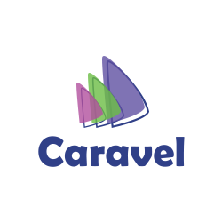

[](https://cocoapods.org/pods/Caravel)

**An event bus for sending messages between UIWebView and embedded JS. Made with pure Swift.**

## Features

* Easy, fast and reliable event bus system
* Multiple bus support
* Multithreading support
* iOS ~> JavaScript supported types:
  - `Bool`
  - `Int`
  - `Float`
  - `Double`
  - `String`
  - Any array (using types in this list)
  - Any dictionary (using types in this list)
* JavaScript ~> iOS supported types:
  - `Boolean`
  - `Int`
  - `Double`
  - `String`
  - `Array` (available as a `NSArray`)
  - `Object` (available as a `NSDictionary`)

## Installation

Install Caravel using CocoaPods:

```ruby
pod 'Caravel'
```

Otherwise, you can install it as a submodule of your project.

Once done, you should find a `caravel.min.js` file in either the Pod or the submodule. Add this file to your project. Then, in each HTML page you have, load it before running your main script:

```html
<script type="text/javascript" src="caravel.min.js"></script>
```

## Migrate from 0.* to 1.*

[Please glance at this blog post](http://www.coshx.com/blog/2015/11/19/releasing-caravel-1-0-0/).

## Get started

Caravel allows developers to communicate between their `UIWebView` and the embedded JS. You can send any kind of message between those two folks.

Have a glance at this super simple sample. Let's start with the iOS part:

```swift
class MyController: UIViewController {
    @IBOutlet weak var webView: UIWebView!
    
    func viewDidLoad() {
        super.viewDidLoad()
        
        // Prepare your bus before loading your web view's content
        Caravel.getDefault(self, webView: webView, whenReady: { bus in
            // The JS endpoint is ready to handle any event.
            // Register and post your events in this scope
            bus.post("MyEvent", data: [1, 2, 3])
            
            self.bus = bus // You can save your bus for firing events later
        })
        
        // ... Load web view content below
    }
}
```

And now, in your JS:

```javascript
Caravel.getDefault().register("AnEvent", function(name, data) {
    alert('I received this array: ' + data);
});
```

And voilà!

## Troubleshooting

### I want to use my custom UIWebViewDelegate. What should I do?

To raise iOS events, Caravel must be the delegate of the provided `UIWebView`. However, if there is any existing delegate, Caravel saves it before setting its own. So, if you would like to use your custom one, simply set it before any call to Caravel.

### Reserved names

`CaravelInit` is an internal event, sent by the JS part for triggering the `whenReady` method.

Also, the default bus is named `default`. If you use that name for a custom bus, Caravel will automatically switch to the default one.

### Keep in mind event and bus names are case-sensitive.

